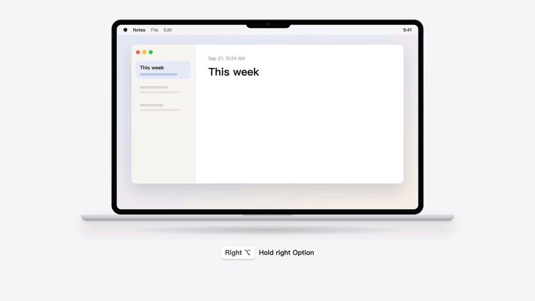

<p align="center">
  
</p>

<h1 align="center">TypeHey</h1>

<p align="center"><b>Hold a key. Talk. It's written.</b><br>
Voice typing for macOS &amp; Windows that turns messy speech into clean text right at your cursor — in any app.</p>

<p align="center">
  <a href="https://typehey.com/download/mac-arm64">Download for Mac (Apple silicon)</a> ·
  <a href="https://typehey.com/download/mac-x64">Mac (Intel)</a> ·
  <a href="https://typehey.com/download/win">Windows</a> ·
  <a href="https://typehey.com">typehey.com</a> ·
  <a href="README.zh-CN.md">中文</a>
</p>

<p align="center"></p>

> **About this repository:** this is TypeHey's public home for documentation, release notes and feedback. The app itself is closed source. Found a bug or want a feature? [Open an issue](https://github.com/xflow-lab/typehey/issues/new/choose).

## Install

- **Download**: [Mac (Apple silicon)](https://typehey.com/download/mac-arm64) · [Mac (Intel)](https://typehey.com/download/mac-x64) · [Windows](https://typehey.com/download/win)
- **Homebrew** (macOS):

  ```sh
  brew install --cask xflow-lab/typehey/typehey
  ```

The app updates itself after installation.

## What it does

- **Hold right ⌥ and talk** (Windows: right Ctrl) — let go and the text appears where your cursor is, in any app: chat, email, docs, your IDE, the terminal.
- **Say it messy, get it clean** — ums, restarts and "three, no wait, four" are fixed; punctuation, paragraphs and numbered lists come out the way you meant them.
- **Hold left ⌥ to control your computer** (Windows: right Alt) — "brightness to 30", "open Terminal in my project and start Claude", "lock the screen". Shutdown and restart always ask first.
- **Auto-send for coding agents** — in Terminal, Claude Code, Codex and VS Code's terminal / AI chat, it can press Enter for you after a short countdown (Esc cancels).
- **Your vocabulary** — add names, product terms and jargon so they're always spelled right. Only affects you.
- **History** — every dictation with the original speech and the cleaned-up text, searchable, one-click copy. Stored only on your computer.
- **Long dictation** — up to 20 minutes in one go.

## Keys

| Key | What it does |
| --- | --- |
| Hold **right ⌥** (Windows: **right Ctrl**) | Dictate. Release to insert the text |
| Tap it | Toggle mode: tap to start, tap again to finish |
| Hold **left ⌥** (Windows: **right Alt**) | Voice control: tell your computer what to do |
| **Esc** | Cancel / dismiss the card above the capsule |

All shortcuts can be changed in Settings → Shortcuts.

## Pricing

- **1 hour free every month**, no card needed.
- After that, pay only for the time you actually speak (pauses and silence are free): **2 hours for $0.99**, **10 hours for $6**. No subscription; purchased time never expires.

## Requirements

- macOS 12 or later (Apple silicon or Intel)
- Windows 10 / 11 (x64 or ARM)
- An internet connection (speech is processed on our servers in Hangzhou and Singapore)

## Privacy

- Your recordings are used only to produce your text; we don't store them.
- History is stored locally on your computer and can be turned off in Settings.
- Your personal vocabulary is stored in your account and only used for your own recognition.

## Feedback & support

- 🐞 Bugs and 💡 feature requests: [GitHub Issues](https://github.com/xflow-lab/typehey/issues/new/choose)
- ✉️ Email: [support@qinaxis.cn](mailto:support@qinaxis.cn)
- ▶️ YouTube: [@typeheyai](https://www.youtube.com/@typeheyai) · 𝕏: [@TypeHey](https://x.com/TypeHey)

What changed in each version: [CHANGELOG.md](CHANGELOG.md).

---

© QINAXIS TECHNOLOGY GROUP LIMITED · Hong Kong. TypeHey is proprietary software; the documents in this repository may be shared with attribution.
